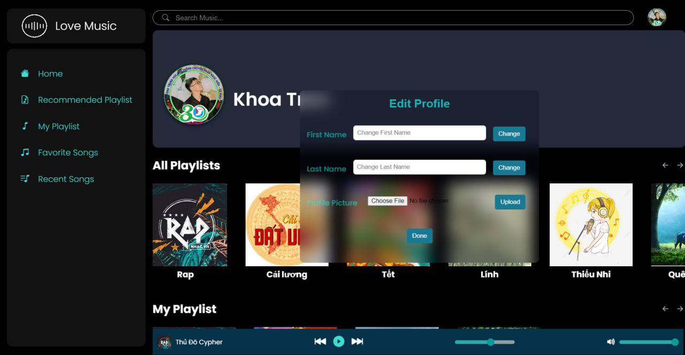
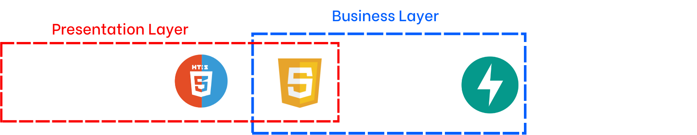
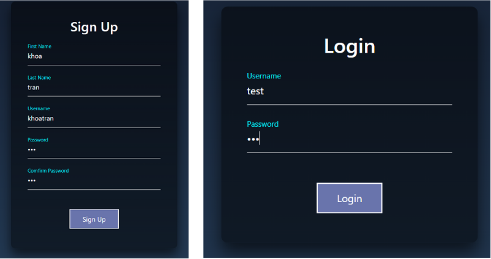
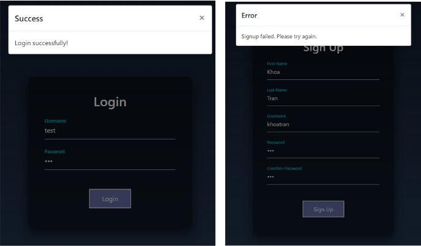
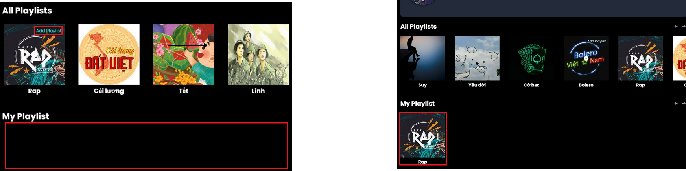
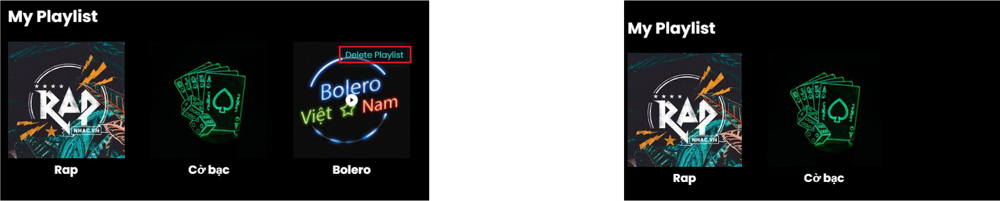
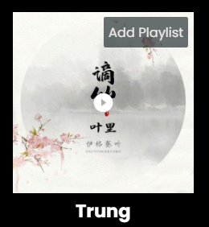
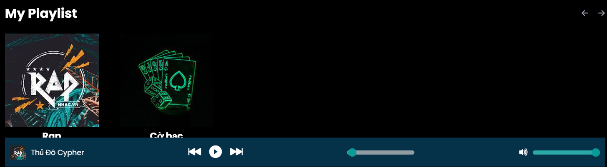
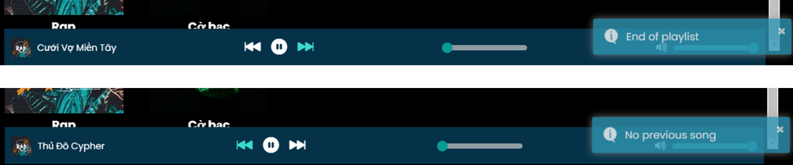
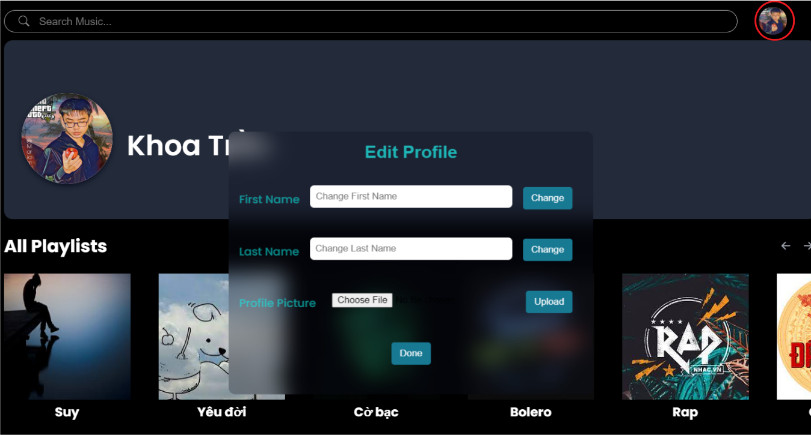

# Project SE104 - Personal Music Plalist Web Application

## I. Introduction

This project, SE104, focuses on developing a personal music streaming web application.




## II. Technologies



### Frontend
- HTML
- CSS
- JavaScript

### Backend
- FastAPI (Python)

### Database
- SQLite3 (Managed using SQLachemy)


## III. Features
### 1. Authentic
- Signup/Login : 

  - User providing information; 

    

  - FastAPI backend handles logic and receive feedback

    

### 2. Add/Delete Users'Playlists
- From All playlists field, users can add Playlists in difference topics to their own playlists

  

- Similar with Delte Playlists, users can pop the playlists fromn their own playlists:

  

### 3. Play Playlists
- Click play button in playlist avatar to play this playlists
  <div style="text-align: center;">

  

  </div>

- Then the interface will display the audio controler with following features:

  

- The system will turn into the next playlist if there aren't any songs in playlists.

### 3. Audio Control
- Button to Ajust the volumn, songtimes, an play/pause

  

- Turn to the next or previous songs in the playlists, and warning if there aren't any songs next or previous

  

### 4. Edit profile
- User can edit FirstName, LastName and Avatar

- Click the mini ava in right corner, the edit form will appear

  

- You can edit every field by clicking Change/Upload button, or edit all field by clicking Done after editing.

## Getting Started

### Setting up Audio Files

First, organize your audio files in the following structure within the "audio" folder:

### Running the Backend

Navigate to the BE folder and set up a virtual environment:

# Running Instructions

## Hosting Backend

First, organize your audio files in the following structure within the "audio" folder:
```
- Playlistname_1
  - Song_name1.mp3
  - Song_name2.mp3
  - ...
- Playlistname_2
  - Song_name3.mp3
  - Song_name4.mp3
  - ...
```
Navigate to the BE folder and set up a virtual environment:


```bash
cd BE
python -m venv fastapi
```

Activate virtual envi:

```bash
fastapi\Script\activate
```

Install the required packages:

```bash
pip install -r requirements.txt
```

Run the FastAPI server:

```
uvicorn main:app --port 8001 --reload

```

## Hosting Frontend

Using Golive server:
```
golive -p 5500

```
Or using Python HTTP server:

```
python -m http.server 5500
```
Now, you can access the web application at http://localhost:5500.


