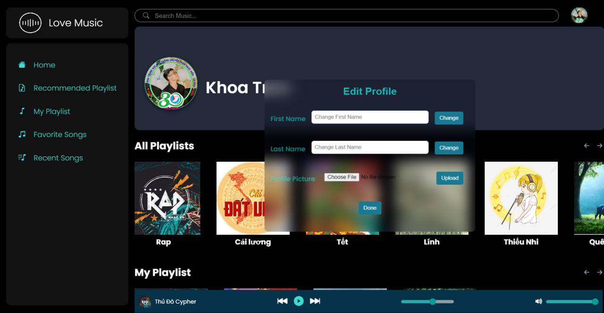

# Project SE104 - Personal Music Streaming Web Application

## Introduction

This project, SE104, focuses on developing a personal music streaming web application.



## Technologies Used

### Frontend
- HTML
- CSS
- JavaScript

### Backend
- FastAPI (Python)

### Database
- SQLite3 (Managed using SQLachemy)

## Getting Started

### Setting up Audio Files

First, organize your audio files in the following structure within the "audio" folder:

### Running the Backend

Navigate to the BE folder and set up a virtual environment:

# Running Instructions

## Hosting Backend

First, organize your audio files in the following structure within the "audio" folder:
```
- Playlistname_1
  - Song_name1.mp3
  - Song_name2.mp3
  - ...
- Playlistname_2
  - Song_name3.mp3
  - Song_name4.mp3
  - ...
```
Navigate to the BE folder and set up a virtual environment:


```bash
cd BE
python -m venv fastapi
```

Install the required packages:

```bash
pip install -r requirements.txt
```

Run the FastAPI server:

```
uvicorn main:app --port 8001 --reload

```

## Hosting Frontend

Using Golive server:
```
golive -p 5500

```
Or using Python HTTP server:

```
python -m http.server 5500
```
Now, you can access the web application at http://localhost:5500.


